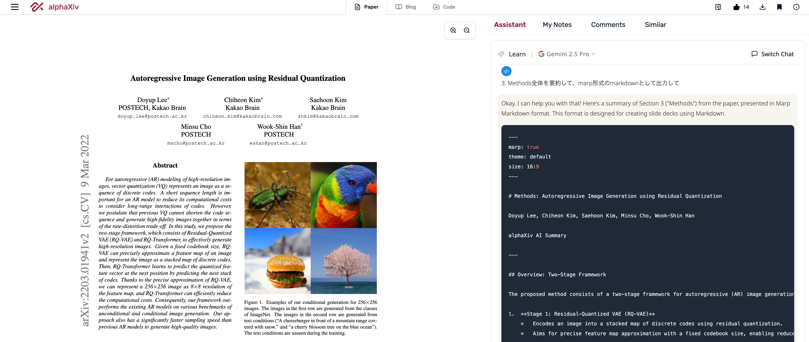

<!-- _class: title -->

# Autoregressive Image Generation using Residual Quantization

Authors: Doyup Lee, Chiheon Kim, Saehoon Kim, Minsu Cho, Wook-Shin Han

Published in: 2022 IEEE/CVF Conference on Computer Vision and Pattern Recognition (CVPR)

Paper: https://arxiv.org/pdf/2203.01941

--
Presenter: yukob (Yu Kobayashi)

---

## Tips - alphaXiv x cursur x Marp

---

## 3. Methods - VAE / VQ-VAE / RQ-VAE + RQ-Transformer

#### VAE (Variational AutoEncoder)

graph LR

image_org["image"]

image_org --> Encoder --> emb
--> Decoder --> image

#### VQ-VAE (Vector-Quantized VAE)

graph LR

image_org["image"]

image_org --> Encoder --> emb --> VQ --> code --> emb_hat
--> Decoder --> image

#### RQ-VAE (Residual-Quantized VAE) + RQ-Transformer

graph LR

image_org["image"]
code["code stack"]

image_org --> Encoder --> emb --> RQ --> code 
--> RQ-Transformer --> emb_hat
--> Decoder --> image

---

## 3. Methods - Overview of Proposed Framework

---

## 3. Methods - 基本はVAE

Encoderで中間表現に変換 (特徴を抽出) して、Decoderで復元できるように学習

---

## 3. Methods - 特徴MapをStackして、残差を量子化

画像のある位置にどんな特徴があるかのMappingを深さ (同じ色の) 方向にもStack
-> 浅い階層の残ったズレ (残差) を量子化していき、深くなるほど残差が減るように

---

## 3. Methods

---

## 3. Methods

---

## 4. Experiments

1.  **非条件付き画像生成 ([LSUN](https://paperswithcode.com/dataset/lsun), [FFHQ](https://paperswithcode.com/dataset/ffhq))**
    -   提案手法 (RQ-VAE + RQ-Transformer)は、既存のARモデルを**上回る性能**
2.  **条件付き画像生成 ([ImageNet](https://paperswithcode.com/dataset/imagenet), [CC-3M](https://huggingface.co/datasets/pixparse/cc3m-wds))**
    -   提案手法 (RQ-VAE + RQ-Transformer)は、既存のARモデルを**上回る性能**
3.  **RQ-Transformerの計算効率**
    -   RQ-VAEによる効率的な画像表現 (短いシーケンス長) と、RQ-Transformerのアーキテクチャにより、**高品質な画像生成**と**計算効率の向上**を両立
4.  **RQ-VAEに関するアブレーションスタディ**
    -   RQ-VAEの各要素の有効性が確認された

---

### 4.1. 非条件付き画像生成 - Dataset等の設定

*   **目的**: 高品質な画像を条件なしに生成する能力を評価
*   **データセット**:
    *   LSUN-{cat, bedroom, church}
    *   FFHQ
*   **評価指標**: Frechet Inception Distance (FID)
    *   生成された5万サンプルと全訓練サンプルの間で計算
    *   数値が低いほど良い性能
*   **比較対象**: VQ-GAN, DCT, ImageBART, DDPM, StyleGAN2など

---

### 4.1. 非条件付き画像生成 - 結果 (数値が低いほど良い)

*   RQ-Transformerは、特に大規模データセット LSUN-{cat, bedroom}で、他の自己回帰 (AR) モデルや拡散モデルを**大幅に上回る**
*   RQ-VAEによる短いシーケンス長が、RQ-Transformerによる長期的な依存関係の学習を容易にした説

---

### 4.1. 非条件付き画像生成 - 生成画像 - LSUN, FFHQ, CC-3M

---

## 4.2. 条件付き画像生成 - Dataset等の設定

*   **目的**: クラスやテキスト記述といった条件つきで、画像を生成する能力を評価
*   **データセット**:
    *   ImageNet (クラス条件付き)
    *   CC-3M (テキスト条件付き)
*   **評価指標**:
    *   ImageNet: FID, Inception Score (IS)
    *   CC-3M: FID, CLIP score

---

## 4.2. 条件付き画像生成 - ImageNet (クラス条件付き)

*   提案手法は、既存のARモデル (VQ-VAE2, DCT, VQ-GANなど) を**大幅に上回る**
*   stochastic sampling ($^\dagger$がついていないもの) も性能向上に寄与
*   大規模モデル (1.4B, 3.8Bパラメータ) では、BigGANに匹敵??

---

## 4.2. 条件付き画像生成 - ImageNet (クラス条件付き)

*   rejection samplingを用いることで、ADMを上回り、**最先端 (SOTA) のFIDスコア**を達成 ($^\ddagger$がついているもの)

---

## 4.2. 条件付き画像生成 - CC-3M (テキスト条件付き)

*   提案手法 (RQ-Transformer) は、同程度のパラメータ数を持つVQ-GANや、より多くのパラメータを持つImageBARTを**大幅に上回る**性能をFIDとCLIPスコアの両方で達成
*   これは、短縮されたシーケンス長により、テキストと画像の関連性学習が容易になったためと考えられる
*   図1および図3には、多様なテキスト条件に基づいた高品質な生成画像の例が示されている (学習データにない新規の組み合わせも含む)

---

## 4.3. RQ-Transformerの計算効率

*   **目的**: RQ-Transformerの速度を評価
*   **比較対象**: VQ-GAN (共に1.4Bパラメータ)
*   **設定**:
    *   VQ-GAN: 入力符号マップ形状 16x16x1
    *   RQ-Transformer: 入力符号マップ形状 8x8x4
    *   単一のNVIDIA A100 GPUを使用
*   **結果**:
    *   batch_size = 100でVQ-GANの**4.1倍**、batch_size = 200で**5.6倍**高速
    *   メモリ効率向上で、VQ-GANでは不可能なbatch_size = 500で実行可能
        *   -> VQ-GAN (バッチサイズ200) の**7.3倍高速** (0.02秒/画像)

---

## 4.4. RQ-VAEに関するAblation Study - 設定

*   **目的**: RQ-VAEにおける符号帳サイズ (K) と符号マップの形状 (H×W×D) の影響調査
*   **評価指標**: rFID (ImageNet検証データにおける元画像と再構成画像のFID)

---

## 4.4. RQ-VAEに関するAblation Study - 結果①

**量子化深度Dの増加**は、符号帳サイズKの増加よりも再構成品質の向上に**効果的**

Table 4 (抜粋)

| モデル            | H×W×D    | K       | rFID (↓) |
| :--------------- | :------- | :------ | :-------- |
| VQ-GAN           | 8×8×1    | 16,384  | 17.95     |
| VQ-GAN           | 8×8×1    | 131,072 | 17.09     |
| RQ-VAE           | 8×8×2    | 16,384  | 10.77     |
| RQ-VAE           | 8×8×4    | 16,384  | 4.73      |

---

## 4.4. RQ-VAEに関するAblation Study - 結果②

codebook sizeをK=16,384をと固定したとき、空間解像度H×Wを16x16から8x8に下げると、rFIDは大幅に悪化するが、量子化深度Dを増やすことでrFIDは大幅に改善する

Table 4 (抜粋)

| モデル            | H×W×D    | K       | rFID (↓) |
| :--------------- | :------- | :------ | :-------- |
| VQ-GAN$^\dagger$ | 16×16×1  | 16,384  | 4.32      |
| VQ-GAN           | 8×8×1    | 16,384  | 17.95     |
| RQ-VAE           | 8×8×2    | 16,384  | 10.77     |
| RQ-VAE           | 8×8×4    | 16,384  | 4.73      |
| RQ-VAE           | 8×8×16   | 16,384  | **1.83**  |

---

## 4.4. RQ-VAEに関するAblation Study - 結果③

深さ d が深くなるほど、残差が減っていそうなことがわかる

---

<!-- _class: title -->

# Appendix

---

## 3. Methods

自己回帰型（AR）画像生成のための2段階フレームワークで構成される

**Stage 1: 残差量子化VAE（RQ-VAE）**
*   残差量子化を用いて画像を離散符号の積層マップにエンコード
*   固定長の符号帳サイズで精密な特徴マップ近似を目指し、空間解像度を低減

**Stage 2: RQ-Transformer**
*   RQ-VAEによって生成された符号スタックのシーケンスを自己回帰的に予測
*   コンパクトな符号表現における長距離の相互作用を効率的に学習するように設計されている

---

### 3.1. Stage 1: RQ-VAE - VQやVQ-VAE

#### 3.1.1 VQとVQ-VAEの定式化
*   **ベクトル量子化（VQ）**: ベクトル $z$ を符号帳 $C = \{(k, e(k))\}_{k \in [K]}$ から最も近い符号埋め込み $e(k)$ にマッピングします
    $$Q(z;C) = \text{arg min}_{k \in [K]} \|z - e(k)\|_2^2$$
*   **VQ-VAE**:
    *   エンコーダ $E$ は画像 $X$ を特徴マップ $Z = E(X)$ にマッピングします
    *   $Z$ は要素ごとに量子化され、符号マップ $M$ と量子化された特徴マップ $\hat{Z}$ を得ます
    *   デコーダ $G$ は画像 $\hat{X} = G(\hat{Z})$ を再構成します

---

### 3.1. Stage 1: RQ-VAE - VQの課題

品質を維持しながら空間解像度 $(H,W)$ を大幅に（例：$H/2, W/2$ に）削減するには、指数関数的に大きな符号帳（例：$K^4$）が必要となり、不安定性を招きます

---

### 3.1. Stage 1: RQ-VAE - RQ

#### 3.1.2 Residual Quantization (RQ)

*   符号帳サイズを増やす代わりに、RQはベクトル $z$ を **単一の共有符号帳 $C$（サイズ $K$）** を用いて順序付けられた $D$ 個の符号 $(k_1, \dots, k_D)$ として表現します。
*   **プロセス（深さ $d=1, \dots, D$）**:
    1.  初期残差 $r_0 = z$
    2.  現在の残差を量子化: $k_d = Q(r_{d-1}; C)$
    3.  残差を更新: $r_d = r_{d-1} - e(k_d)$
*   量子化されたベクトルは $\hat{z} = \sum_{i=1}^D e(k_i)$ です。深さ $d$ までの部分和 $\hat{z}^{(d)} = \sum_{i=1}^d e(k_i)$ は、粗いものから細かいものへと近似を行います

---

### 3.1. Stage 1: RQ-VAE - RQの利点

深さ $D$ のRQは、実質的に $K^D$ 個の量子化クラスタを表現でき、これはサイズ $K^D$ の符号帳を持つVQと同様ですが、より小さく固定サイズの符号帳で実現できます。

---

### 3.1. Stage 1: RQ-VAE - Architecture

#### 3.1.3 RQ-VAEアーキテクチャ

*   VQ-VAE（エンコーダ $E$、デコーダ $G$）と同様ですが、VQモジュールがRQモジュールに置き換えられています
*   エンコーダ $E(X)$ は特徴マップ $Z$ を生成します
*   各ベクトル $Z_{hw}$ はRQによって量子化されます: $M_{hw} = \text{RQ}(Z_{hw}; C, D) \in [K]^D$
*   これにより、積層符号マップ $M \in [K]^{H \times W \times D}$ が得られます
*   深さ $d$ における量子化された特徴マップは $\hat{Z}^{(d)}_{hw} = \sum_{d'=1}^d e(M_{hwd'})$ です
*   最終的な再構成: $\hat{X} = G(\hat{Z}^{(D)})$

---

### 3.1. Stage 1: RQ-VAE - RQ-VAEの利点

*   同じ符号帳サイズのVQ-VAEよりも現実的な再構成。
*   品質を維持しながら、空間解像度 $(H,W)$ のより大きな削減が可能。

---

### 3.1. Stage 1: RQ-VAE - RQ-VAEの学習

*   **損失関数**: $L = L_{\text{recon}} + \beta L_{\text{commit}}$
    *   再構成損失: $L_{\text{recon}} = \|X - \hat{X}\|_2^2$
    *   コミットメント損失: $L_{\text{commit}} = \sum_{d=1}^D \|Z - \text{sg}[\hat{Z}^{(d)}]\|_2^2$
        *   `sg` は勾配停止（stop-gradient）。深さ $d$ にわたって合計することで、$\hat{Z}^{(d)}$ が逐次的に量子化誤差を減少させることを促進します
*   RQの逆伝播にはStraight-through推定量を使用。
*   符号帳 $C$ は指数移動平均によって更新。
*   **敵対的学習**: パッチベースの敵対的損失と知覚的損失（VQ-GANと同様）を使用して知覚品質を向上させます。

---

### 3.2. Stage 2: RQ-Transformer - ARモデリング

#### 3.2.1 深さDの符号に対するARモデリング

*   RQ-VAEは符号マップ $M \in [K]^{H \times W \times D}$ を出力します。
*   ラスタースキャンにより $M$ は $S \in [K]^{T \times D}$（ただし $T=HW$）に再配置されます。
*   $S_t = (S_{t1}, \dots, S_{tD})$ は空間位置 $t$ における $D$ 個の符号のスタックです。
*   ARモデルは $p(S) = \prod_{t=1}^T \prod_{d=1}^D p(S_{td} | S_{<t,d}, S_{t,<d})$ を学習します。

---

### 3.2. Stage 2: RQ-Transformer - Architecture

*   $T \times D$ の符号マップを効率的に予測するように設計されています。
*   **空間トランスフォーマー（Spatial Transformer）** と **深さトランスフォーマー（Depth Transformer）** で構成されます。

---

### 3.2. Stage 2: RQ-Transformer - Spatial Transformer

**Spatial Transformer**

*   ステップ $t$ での入力: $u_t = \text{PE}_T(t) + \sum_{d=1}^D e(S_{t-1,d})$ （位置エンコーディング + *前の*空間ステップ $t-1$ からの符号埋め込みの合計）。$u_1$ は学習可能な「シーケンス開始」埋め込みです。
*   $S_{<t}$ を要約するコンテキストベクトル $h_t = \text{SpatialTransformer}(u_1, \dots, u_t)$ を出力します。

---

### 3.2. Stage 2: RQ-Transformer - Depth Transformer

*   $h_t$ が与えられると、現在の空間位置 $t$ に対して $D$ 個の符号 $(S_{t1}, \dots, S_{tD})$ を自己回帰的に予測します。
*   深さ $d'$（$S_{td'}$ を予測するため）での入力: $v_{td'} = \text{PE}_D(d') + \sum_{j=1}^{d'-1} e(S_{tj})$ （深さの位置エンコーディング + *現在の*空間ステップ $t$ の深さ $d'-1$ までの符号埋め込みの合計）。
*   $d'=1$ の場合、$v_{t1} = \text{PE}_D(1) + h_t$。
*   条件付き分布 $p_{td'} = \text{DepthTransformer}(v_{t1}, \dots, v_{td'})$ を出力します。

*   **学習損失**: 負の対数尤度（NLL） $L_{\text{AR}} = \mathbb{E}_{S} \mathbb{E}_{t,d} [-\log p(S_{td} | S_{<t,d}, S_{t,<d})]$。

---

### 3.2. Stage 2: RQ-Transformer - 計算複雑性

*   単純なTransformer（$S$ を長さ $TD$ に展開）: $O(N T^2 D^2)$。
*   RQ-Transformer: $O(N_{\text{spatial}} T^2 + N_{\text{depth}} T D^2)$。
    *   $N_{\text{spatial}}, N_{\text{depth}}$ は各トランスフォーマーの層の数。
    *   それぞれ個別に処理されるより短いシーケンス長 $T$（空間）と $D$（深さ）のため、大幅に効率的です。

---

### 3.2. Stage 2: RQ-Transformer - 露出バイアス

**露出バイアス**

訓練時は正解データ、推論時はモデル自身の予測を用いることによる不一致

---

### 3.2. Stage 2: RQ-Transformer - Soft Labeling

#### 3.2.3 Soft Labelingと確率的Sampling

**Target符号のSoft Labeling**:

*   温度スケール化された符号上のカテゴリカル分布として $Q_{\tau}(k|z) \propto \exp(-\|z - e(k)\|_2^2 / \tau)$ を定義します。
*   NLL損失における $S_{td}$ のワンホットターゲット $Q_0(\cdot|r_{t,d-1})$ の代わりに、ソフト化された分布 $Q_{\tau}(\cdot|r_{t,d-1})$ を教師として使用します。

---

### 3.2. Stage 2: RQ-Transformer - 確率的Sampling

**RQ-VAEからの符号の確率的Sampling**:

*   RQ-VAEから（RQ-Transformerの訓練用に）符号 $S_{td}$ を生成する際、決定論的な $k_d = Q(r_{d-1};C)$ の代わりに $Q_{\tau}(\cdot|r_{t,d-1})$ から $S_{td}$ をサンプリングします。
*   同じ画像特徴マップに対して多様な符号構成を提供します。

これらの手法は、符号帳内の幾何学的関係を活用します。
